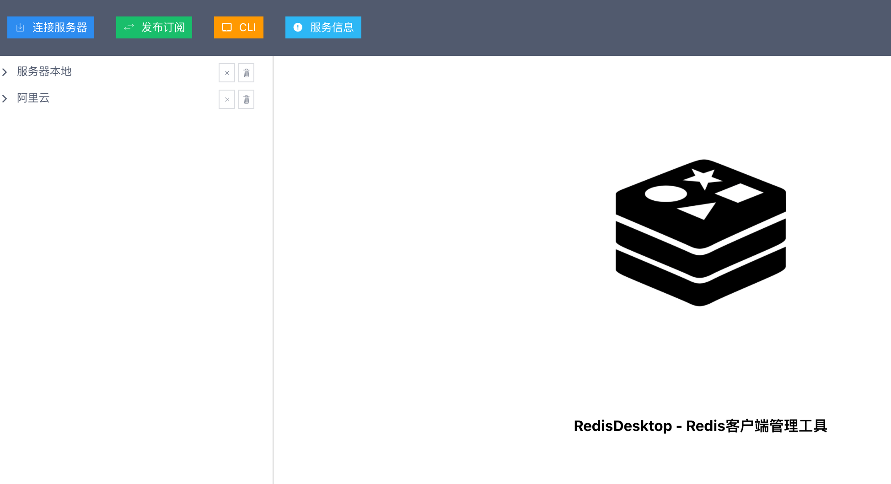
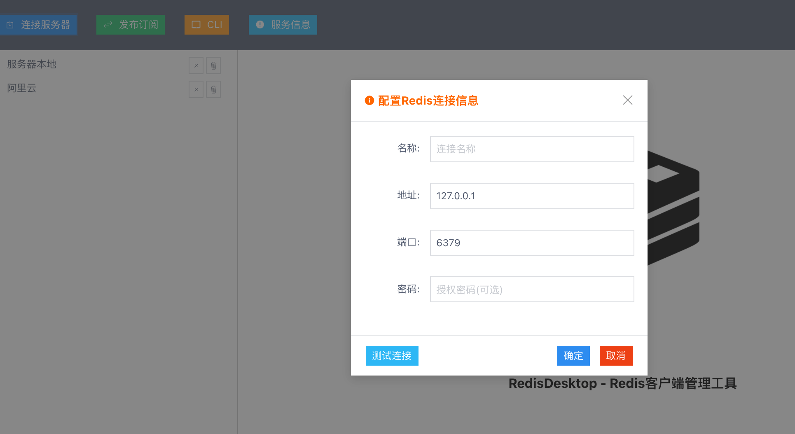
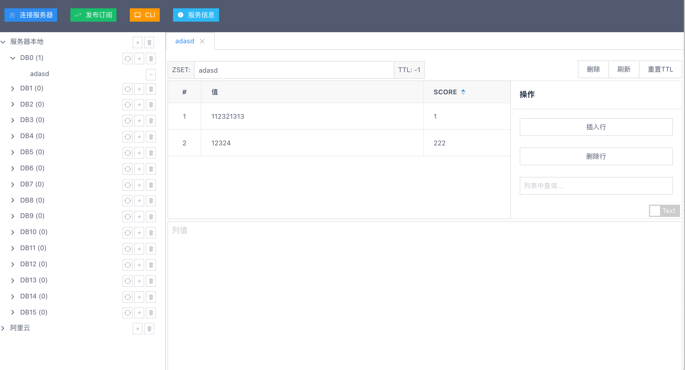
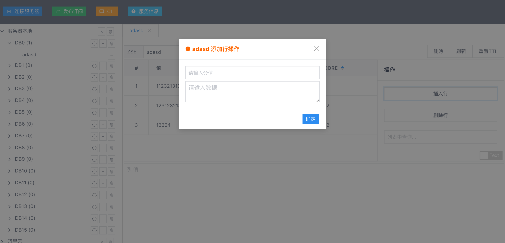
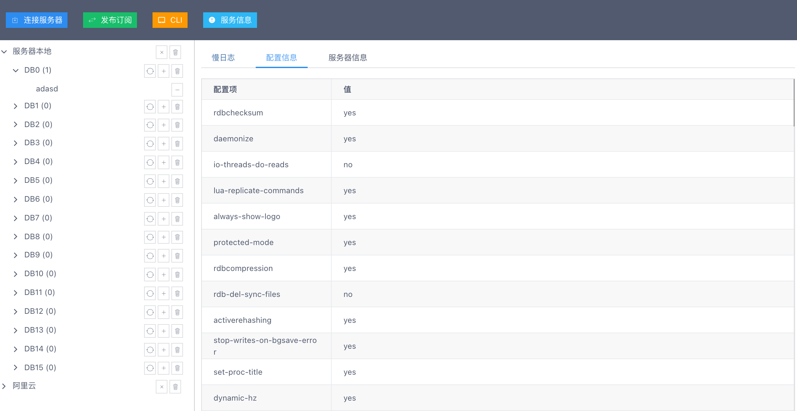
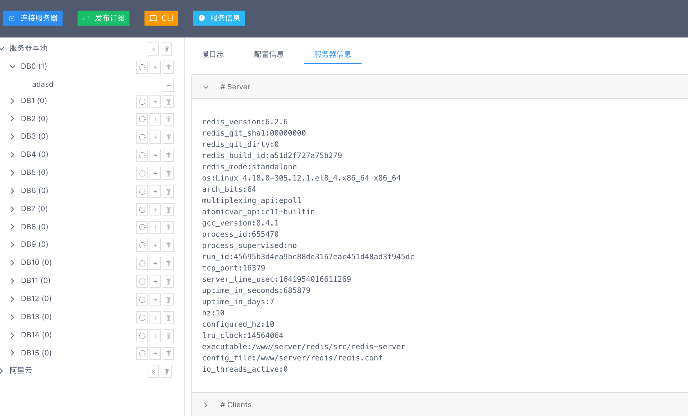
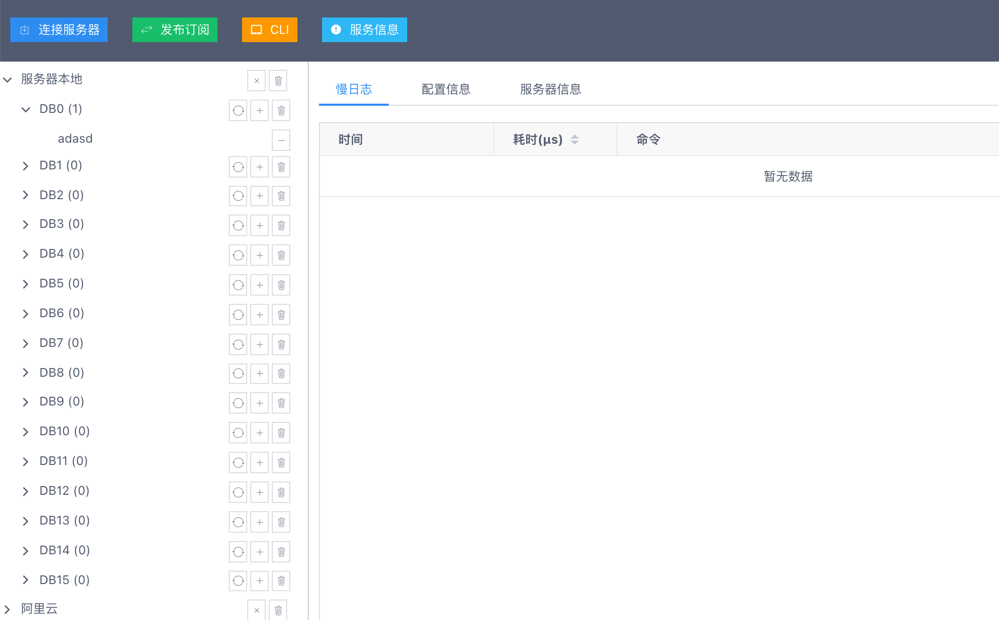
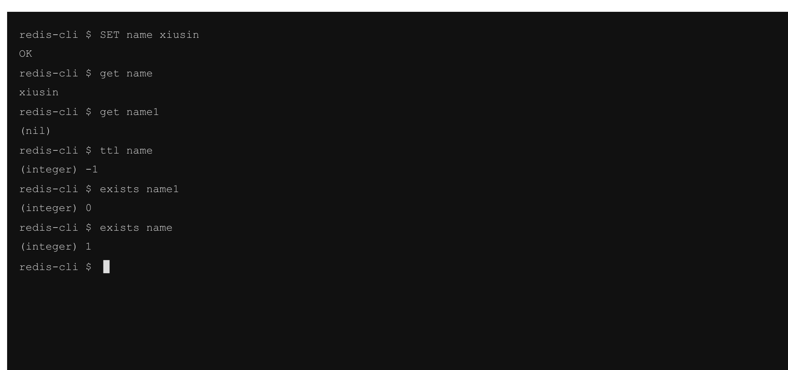

# web-redis-manager #

redis的web管理客户端, 支持同时管理多个redis实例, 慢日志, 服务器信息, 配置信息, CLI模式.

> 演示案例: <http://rdm.xiusin.cn>
>
> 账号: admin 密码:123456

## 特性 ##

- basic auth
- 支持redis常用数据类型管理: `list`, `string`, `hashmap`, `set`, `sorted set`, `stream`等.
- CLI命令行模式
- 慢日志
- 服务信息
- 发布订阅模式
- 图表监控


## TODO ##
- [ ] 只读模式,屏蔽隐藏修改操作
- [ ] 发布订阅问题处理 (Websocket异常关闭)
- [ ] 大list/set/map造成页面卡顿优化 (组件最小化 https://www.jianshu.com/p/1ea5d87e06f9)
- [ ] 连接失败时自动关闭(清理节点loading状态)
- [ ] list / set / stream等数据优化
- [ ] list / hash / zset编辑

## 使用方法 ##

```shell
git clone --depth=1 https://github.com/xiusin/web-redis-manager.git
cd web-redis-manager
git checkout develop

yarn # 安装前端依赖
yarn build # 打包前端代码

cd server

go mod tidy # 下载go依赖包

go build -o rdm.exe # 编译 windows
go build -o rdm # *nix

# 非basic auth启动
./rdm.exe

# basic auth启动 (用于web端授权密码登录)
./rdm.exe --username=admin --password=123456

```

## 示意图 ##

### 入口页面 ###



### 连接实例 ###



### 管理键 ###



### 操作值 ###



### 配置信息 ###



### 服务器信息 ###



### 慢日志 ###



### CLI管理 ###


